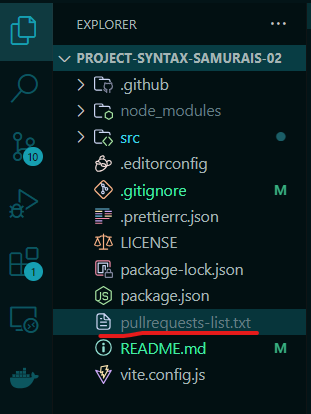
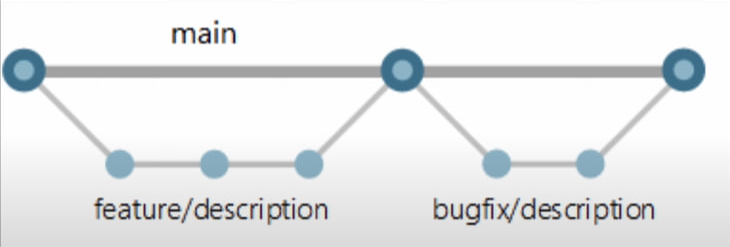

# This is GOIT "Javascript Team Project"(project-syntax-samurais-02)

### Actions after copy Project from GitHub to local machine
1. Install dependency: `npm install`
2. Start project: `npm run dev`

#### Please create file in root directory to save your pull requests
File name should be: `pullrequests-list.txt`


> [Maket Figma](https://www.figma.com/file/fww6BUe77KIm14vo9i8Agm/Portfolio?type=design&node-id=2-9&mode=design&t=zcCmVU4iSoP0lhae-0)

> [Technical Task](https://docs.google.com/spreadsheets/d/1azRSKj2AE0FayFVo_DkUqr6e6ZNelDiPhDzbWWYX3uc/edit#gid=0)

> [Trello](https://trello.com/b/uaiWkcM0/blended-js-project)

> [Branch naming link to video](https://www.youtube.com/watch?v=-2lFpVjdXEg&list=PLViULGko0FdhZ99yYnqB64F_4nVyvOPH5&index=14)


> [Work with branches link to video](https://www.youtube.com/watch?v=AJ8B4HhgZlw&list=PLViULGko0FdhZ99yYnqB64F_4nVyvOPH5&index=15)

> [Work with branches conflict link to video](https://www.youtube.com/watch?v=h-ESKO6r7_4&list=PLViULGko0FdhZ99yYnqB64F_4nVyvOPH5&index=17)

## Libraries


> [On Scroll Animation library link](https://michalsnik.github.io/aos/)

**install:**
` npm install aos --save `

**Use:** (all classes see in the web site)
```html
<script>
  AOS.init();
</script>
```

> [Accordion library link](https://github.com/michu2k/Accordion)

**install:**
```javascript
npm install accordion-js
```
**Use:**
```javascript
import Accordion from 'accordion-js';
import 'accordion-js/dist/accordion.min.css';
```

> [Swiper library link](https://swiperjs.com/swiper-api)

**install:**
```npm install swiper ```

**Use:**
```javascript
// import Swiper JS
import Swiper from 'swiper';
// import Swiper styles
import 'swiper/css';
const swiper = new Swiper(...);
```
**Example:**

```js
const swiper = new Swiper('.swiper', {
  // Optional parameters
  direction: 'vertical',
  loop: true,

  // If we need pagination
  pagination: {
    el: '.swiper-pagination',
  },

  // Navigation arrows
  navigation: {
    nextEl: '.swiper-button-next',
    prevEl: '.swiper-button-prev',
  },

  // And if we need scrollbar
  scrollbar: {
    el: '.swiper-scrollbar',
  },
});
```


> [Izitoast library link](https://izitoast.marcelodolza.com/)

**install:**
`npm install izitoast --save`

**Use:**
```js
import iziToast from "izitoast";
import "izitoast/dist/css/iziToast.min.css";
```
**Example:**
```js
iziToast.show({
    title: 'Hey',
    message: 'What would you like to add?'
});
```

>[Axios library link](https://axios-http.com/docs/intro)

**install:**
` npm install axios`

**Example:**
```js
axios({
  method: 'post',
  url: '/user/12345',
  data: {
    firstName: 'Fred',
    lastName: 'Flintstone'
  }
});
```
